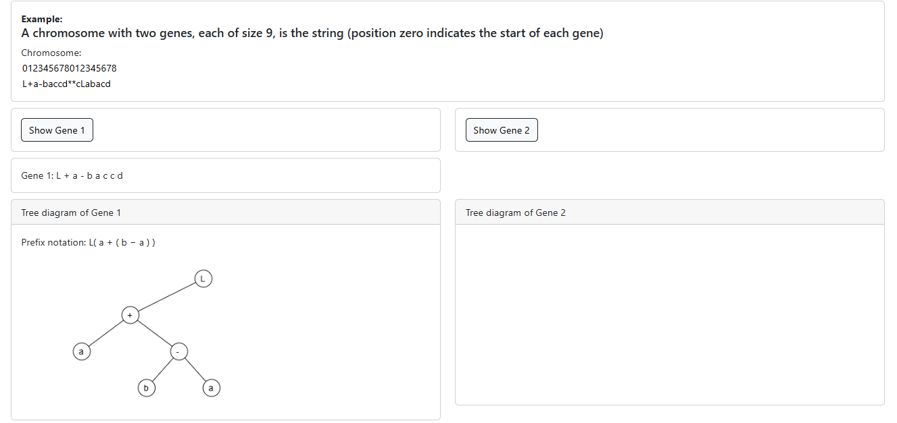
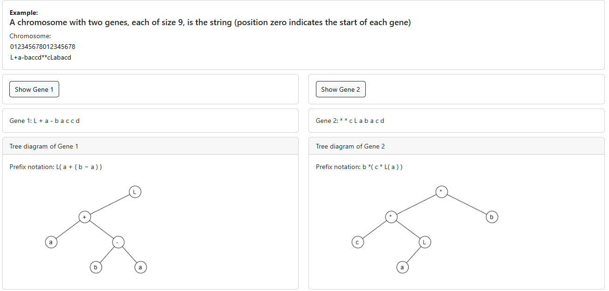

## Procedure

1. Click on "Show Gene 1" button to display the tree diagram and prefix notation of gene 1

2. Click on "Show Gene 2" button to display the tree diagram and prefix notation of gene 2

